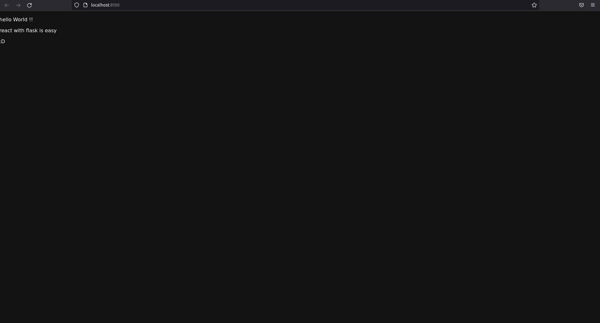

# React-with-Flask

this repo contains a example of website using react and ionic for frontend and flask for backend. This project is using "[Learn Flask for Python - Full Tutorial](https://youtu.be/Z1RJmh_OqeA) by ___freeCodeCamp.org___ and [How to Create a Flask + React Project | Python Backend + React Frontend](https://youtu.be/7LNl2JlZKHA) by ___Arpan Neupane___.

Bellow, is possible to see the actual webpage.

